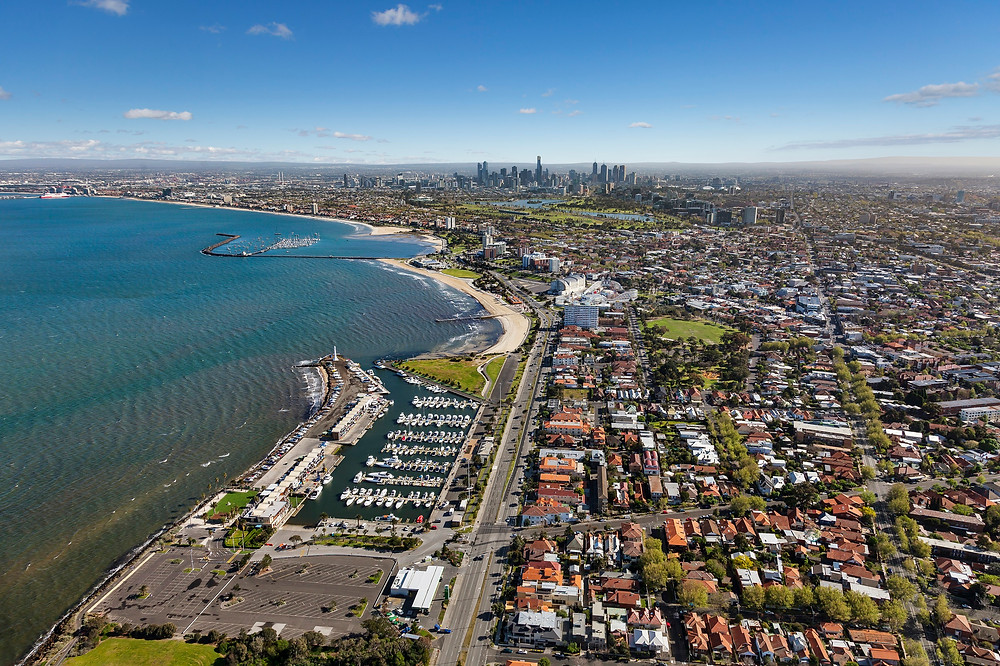

# OtusIntel: Mitigating the risk under our feet
## Overview
OtusIntel is a Sydney based Australian fintech company that specializes in risk management, property risk, and spatial data analytics [1]. The primary focus of the group is the use of satellite data to identify areas of ground movement, this data can be linked to property damage and can be used to identify areas of potential risk during property development or portfolio management. The company also claims the technology provides the potential to predict commodity prices and optimise crop production.

OtusIntel was founded in 2016 by CEO - Marc Beaudry, with more than 15 years as a professional in geotechnical business development[2]. Marc saw an opportunity to offer services often seen in the private sector to those in the public and government sectors. OtusIntel have made headway into a variety of sectors for property risk management including banking, valuations, Insurance, and legal. They offer a variety of property reports ranging from $250 AUD for a residential report, up to $999 AUD for commercial applications. Update reports are also available to provide a temporal understanding of ground movement. The company provides a surface movement risk index which evaluates property risk based on data from over 9 million Australian properties[3].

---

## Why do we need this?
An ever-increasing population and higher density cities are resulting in the need for better and more efficient housing. These population pressures also come with a requirement of more infrastructure. Installation of high-rise buildings with foundations that reach deep into bedrock and tunnelling for complex transport networks has meant that the ground around us has never been more volatile[11].

Ground movement of just 10-15mm can cause significant damage to residential housing, without ground movement data, causation of damage can be difficult to prove in insurance claims and damage reports.
Additionally, movement during or after construction can cause the structure to fail to meet specification, leading to unforeseen costs and budget blowouts [9].

---

## The technology behind the claims
The past 10 years has seen an explosion in the use of big data [6], coupled with the recent hype around space exploration[7], the data generated in space is receiving quite a lot of attention. OtusIntel use radio wave image data generated by satellites [4] to track ground movement, analysis of the data reveals surface level movements on the order of millimetres. Additionally, the company has collaborated with SpiralBlue to implement machine learning into their workflow to provide a property risk index [5].

---

## Limitations and opportunity
The technology represents a reliable and accurate method of measuring present ground movement, this is acceptable for parties willing investigate property damage or mitigate risk, however, the company lacks a predictive model for analysis of future ground movements.

A potential opportunity would be to investigate ground movement in relation to major earthworks projects and combine satellite data with traditional engineering methods [10] and a machine learning model to build a predictive model for ground movement in earthworks projects.

---

## Who’s the competition
Companies currently using similar technology include OptaSense, which is a globally operating satellite data company providing ground movement and risk assessment for underground cables and pipelines. SatSense is another company that provide a similar service to OtusIntel; however, they are a UK based company and have not made headway into the Australian market.

The lack of Australian competition provides OtusIntel with a unique opportunity to capture the Australian public market for satellite based ground movement reporting. In the future, these reports may be something that every Australian home buyer/investor will consider as part of their due diligence.

---

## Resources
#### About the company/employees
[1] (https://www.linkedin.com/company/otusintel/about/)

[2] (https://www.linkedin.com/in/beaudrym/details/experience/)

[3] (https://otusintel.com/company/about-us/)

#### News stories
[4] (https://www.9news.com.au/national/westconnex-sydney-news-inner-west-damage-houses/6b9517a7-6380-45ae-b8c6-e48595e1c1fa)

[5] (https://otusintel.com/spiral-blue-and-otus-intel-partner-to-develop-surface-movement-risk-index/)

#### The origin of Big Data
[6] (https://towardsdatascience.com/what-is-big-data-understanding-the-history-32078f3b53ce)

#### Analysing space data
[7] (https://www.intel.co.uk/content/www/uk/en/analytics/amazing-stories/big-data-from-satellites.html#:~:text=Space%20data%20%E2%80%93%20or%20big%20data,as%20'really%20big%20data'.)

[8] (https://www.skywatch.com/blog/free-sources-of-satellite-data)

#### Regulations
[9] (https://www.vba.vic.gov.au/__data/assets/pdf_file/0003/134355/Guide-to-Standards-and-Tolerances-2015.pdf)

#### Non-satellite ground movement technology
[10] (https://www.hindawi.com/journals/sv/2022/6289303/)

[11] (https://bigbuild.vic.gov.au/__data/assets/pdf_file/0006/524976/NELP-EES-Technical-report-M-Ground-movement.pdf)

